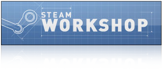
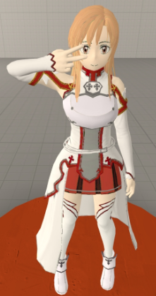

<hr>

### Introduction

Back in 2018, I immersed myself in the captivating world of Garry's Mod (Gmod), a physics-based sandbox game available on Steam for PC. One of the remarkable features of Gmod was its use of the Lua programming language, providing players with tools to develop their own game modes. During that time, the most popular gamemodes were Trouble in Terrorist Town, DarkRp, and my personal favorite, DeathRun. Each gamemode was usually developed by small groups of players and released publicly, allowing others to host their own versions.

### DeathRun Server

Driven by my passion for DeathRun, I decided to host my own server for this gamemode. In DeathRun, two groups of 20 or more players participate in each round: two random players are chosen to play as "Death," while the rest become "Runners." The Runners must navigate through a map full of traps, which can be activated by the Death players at the press of a button. The game concludes when either all Runners are eliminated or if some manage to survive until the end.

### Expanding the Server

To enhance the popularity of my DeathRun server, I implemented a point-based shop system, created by another player. Players on my server earned points based on their playtime and performance in the game. These points could then be used to purchase in-game cosmetics. This is where my 3D modeling skills came into play.

### Learning 3D Modeling

For this project, I dived into the world of 3D modeling, learning how to rig, skin, and port models for Gmod. I successfully ported over the Asuna model from a Sword Art Online video game. Although my early attempts at texturing were rudimentary, it was a rewarding experience to see the character come to life in Source Film Maker.

### Lua Scripting for Addon Integration

To make the models playable as characters in Gmod, I utilized Lua scripting. Here's an example of how I integrated the "Asuna" model as a playable character using Lua code:

```lua
player_manager.AddValidModel("Asuna", "models/player/sao/asunav2.mdl");
list.Set("PlayerOptionsModel", "Asuna", "models/player/sao/asunav2.mdl");
```

### Steam Workshop Addons

I proudly uploaded my 3D models as addons to the Steam Workshop, making them accessible to the Gmod community. You can check out my Steam Workshop addons at this [steam link](https://steamcommunity.com/id/sidestep/myworkshopfiles/).



### Conclusion

This project not only honed my 3D modeling skills but also allowed me to contribute to the vibrant Garry's Mod community. I enjoyed seeing players on my server embrace these custom playermodels and the sense of accomplishment they brought to the DeathRun gamemode.