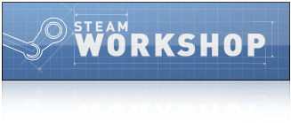
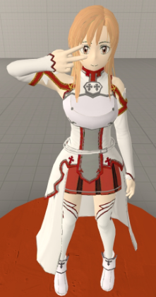

<div class="ui small rounded images">
  
</div>

Back in 2014, I used to play a physics based sandbox game called Garry's Mod (Gmod) on the steam platform for pc. It's a game that uses the Lua programming language, giving players the tools they need to develop their own gamemodes. The most popular gamemodes during my time playing were: Trouble in Terrorist Town, DarkRp, and my personal favorite DeathRun. Each gamemode was usually developed by a small group of players and realeased to the public so everyone could host their own version of it. 

I hosted my own server of the gamemode DeathRun in which there are two group of 20 or more players. Each round 2 random players are selected to play as Death and the rest are Runners. The Runners have to run through a map full of traps that can be activated by Death players at the press of a button. The game ends if all Runners are eliminated or if some Runners manage to survive till the end.

To grow the popularity of my server, I implemented a point based shop system developed by another player. Players who played on my server were awarded points for time played and for winning a round. They could then use those points to buy cosmetics. The cosmetics were the models I learned to rig, skin, and port.

Here is some code that illustrates how lua is used in an addon to make the mdl playable as a character:

```lua
player_manager.AddValidModel( "Asuna", 	"models/player/sao/asunav2.mdl" );
list.Set( "PlayerOptionsModel", "Asuna", 	"models/player/sao/asunav2.mdl" );
```

I ported over the model Asuna from a sword art online video game.
Here is a picture of the model in source film maker: (Note - I remember making the textures for the model which is why it looks so poorly done)
<div class="ui small rounded images">
  
</div>

You can view my steamworkshop addons at this [steam link](https://steamcommunity.com/id/sidestep/myworkshopfiles/).


