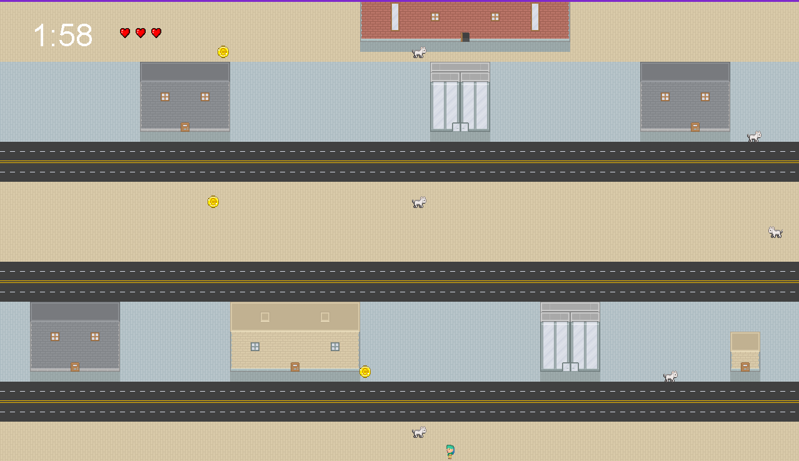

The Chase is a simple game developed in Java in which the player has to collect 3 gold coins and make it to the other end of the map before the timer runs out. The challenge is that there are animals and cars that may hit you while you traverse the map. You start with 3 lives and if you get hit, you lose one life and get sent back to the start.

In this project I gained experience with using classes in Java and collaborating with other team members. 
