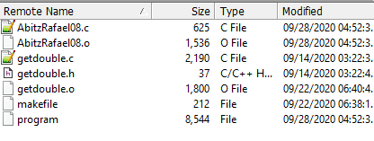

  

This program will first calculate the hypothenuse of a right angle triangle with randomly generated lengths from 1-255. You can then type in your own values for each side to calculate the hypotenuse or find the sin, cos, and tan of radians. The functions used in this program are sqrt(), srand(), pow(), sin(), cos(), tan().

Source code to be made available soon.
