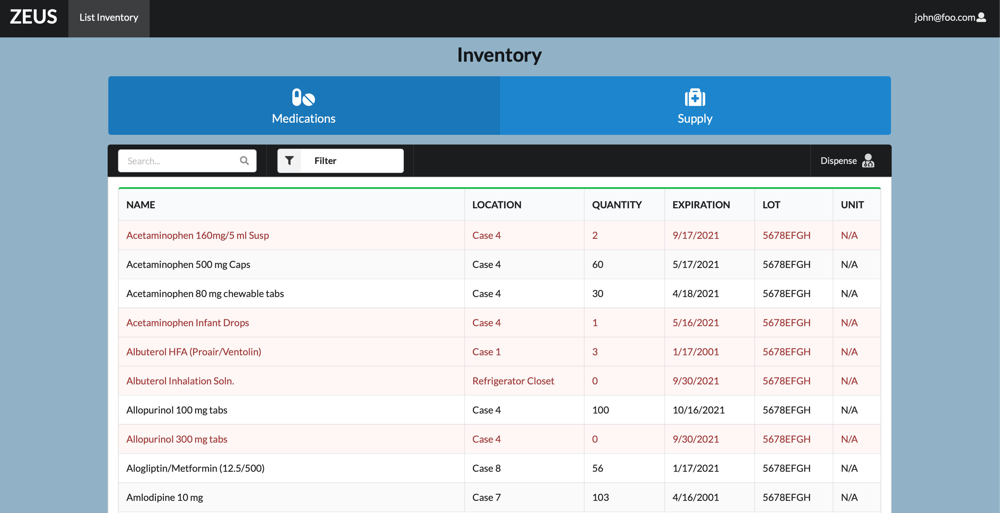

## Overview

an online application aimed at managing the inventory of medical supplies for clinics in Hawai’i. The project focuses on creating a simple and user-friendly interface for users to easily interact with the system.

## Key Features

- Landing page with options to login or register a new user account.
- User home page providing welcome messages and guidelines.
- Inventory information display for medications and supplies.
- Search and filter options for items based on various parameters.
- Dispense page to manage medication or supply dispensing.
- Admin page to edit/delete inventory information and manage users.
- Developer guide for Meteor developers interested in using the codebase.
- Development history documented through Milestones and GitHub Project Boards.

## Members

The team behind "UH Cryptics" is the UH Cryptics Organization, consisting of members named Chase, Cheolhoon, Daniel, Deshay, Jessica, Luke, Rafael, and Sheena. The project is published using GitHub Pages.

Visit us on [Github](https://uh-cryptics.github.io/)